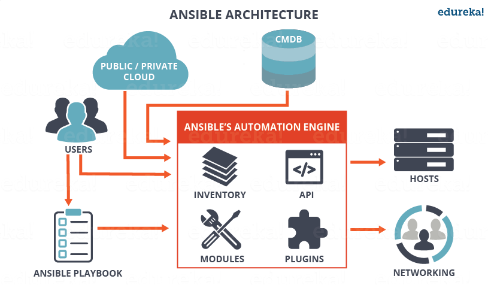

# Tổng quan về ansible

## 1. Giới thiệu

Ansible có thể gọi là một công cụ thục hiện tự động triển khai một cái gì đó cho số lượng lơn các client. Nó có thể cấu hình hệ thống, triển khai phần mềm, thực hiện điều phối các tác vụ triển khai liên tục, update zero downtime.

Ansible hướng tới việc quản trị hệ thống của người system admin đơn giản hơn, đảm bảo yếu tố bảo mật và độ tin cậy, sử dụng OpenSSH để vận chuyển các tác vụ.

Phù hợp với nhiều môi trường như: Nhà phát triển, system admin, và `everyone in between`. Nó thíc hợp cho môi trường ít cho đến môi trường doanh nghiệp lớn.

Ansible quản lý theo kiểu không có agent. Ansible có thể dễ dàng kết nối với Kerberos, LDAP và các hệ thống quản lý xác thực tập trung khác.

Ba đến 4 năm Ansible mới phát hành ra một bản mới. Cũng có cộng đồng phát triển các modul và các plugin. Được build bằng Python và sử dụng file cấu hình theo dạng YAML (YAML Ain’t Markup Language) dễ đọc và có thể dễ hiểu.

Phát triển song song với ansible có một số công cụ như `SaltStack`, `Chef`, `Puppet`.

## 2. Đặc điểm

- Agentless

- Sử dụng giao thức SSH

- File cấu trúc YAML

- Đầy đủ power của CLI

- Mã hóa và bảo mật do được built in

- Cấu trúc linh hoạt với (ad-hoc, playbooks, roles, orchestration)

## 3. Kiến trúc

Ansible sử dụng kiến trúc agentless để giao tiếp với các máy khác mà không cần agent. Cơ bản nhất là giao tiếp thông qua giao thức SSH trên Linux, WinRM trên Windows hoặc giao tiếp qua chính API của thiết bị đó cung cấp.

Tác đông tới client theo giao thức SSH.

Gồm các thành phần: Ad-hoc Commands, inventory, playbook.

## 4. Các khái niệm cơ bản

+ **Controller Machine**: Là máy cài Ansible, chịu trách nhiệm quản lý, điều khiển và gởi task tới các máy con cần quản lý.

+ **Inventory**: Là file chứa thông tin các server cần quản lý. File này thường nằm tại đường dẫn `/etc/ansible/hosts`.

+ **Playbook**: Là file chứa các task của Ansible được ghi dưới định dạng YAML. Máy controller sẽ đọc các task trong Playbook và đẩy các lệnh thực thi tương ứng bằng Python xuống các máy con.

+ **Task**: Một block ghi tác vụ cần thực hiện trong playbook và các thông số liên quan. Ví dụ 1 playbook có thể chứa 2 task là: yum update và yum install vim.

+ **Module**: Ansible có rất nhiều module, ví dụ như moduel yum là module dùng để cài đặt các gói phần mềm qua yum. Ansible hiện có hơn ….2000 module để thực hiện nhiều tác vụ khác nhau, bạn cũng có thể tự viết thêm các module của mình nếu muốn.
+ **Role**: Là một tập playbook được định nghĩa sẵn để thực thi 1 tác vụ nhất định (ví dụ cài đặt XAMP).

+ **Play**: là quá trình thực thi của 1 playbook

+ **Facts**: Thông tin của những máy được Ansible điều khiển, cụ thể là thông tin về OS, network, system…

+ **Handlers**: Dùng để kích hoạt các thay đổi của dịch vụ như start, stop service.

