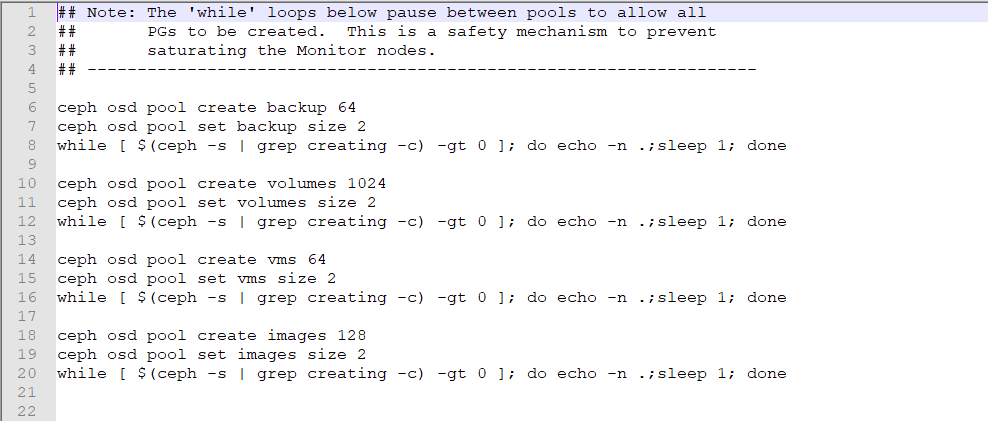
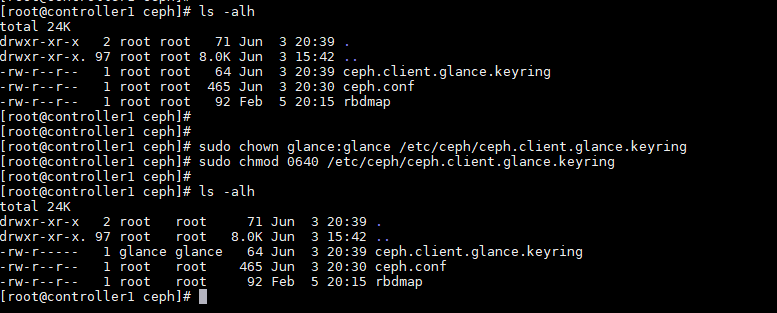
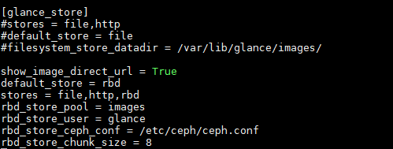
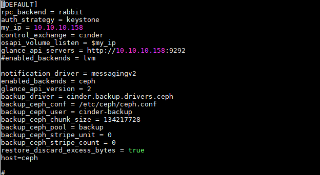
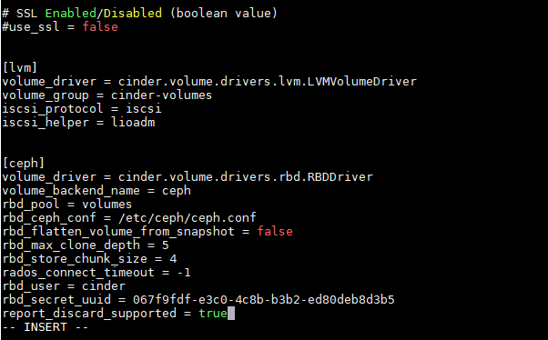

# Ghi chép lại các bước tích hợp CEPH - Openstack

### Mục lục

[1. Mô hình triển khai](#mohinh)<br>
[2. IP Planning](#planning)<br>
[3. IP Các bước thực hiện tích hợp](#step)<br>

<a name="mohinh"></a>
## 1. Mô hình triển khai


- Triển khai trên môi trường ảo hóa VMware ESXi.

- CEPH gồm 3 node CEPH mỗi node có 3 OSDs. Tham khảo cài đặt <a href="https://github.com/domanhduy/ghichep/blob/master/DuyDM/CEPH/thuc-hanh/docs/2.huong-dan-cai-dat-ceph-luminous.md" target="_blank">tại đây</a>!

- Openstack gồm 1 node Controller, 2 node Compute. Tham khảo cài đặt <a href="https://github.com/domanhduy/ghichep/blob/master/DuyDM/Openstack/install-openstack/docs/manual.md" target="_blank">tại đây</a>!

<a name="planning"></a>
## 2. IP Planning


<a name="planning"></a>
## 3. Các bước thực hiện tích hợp

Về cơ bản Openstack có 3 service có thể tích hợp để lưu trữ xuống dưới CEPH.

- Glance (images): Lưu trữ các images xuống CEPH.

- Cinder (volume): Lưu trữ các ổ đĩa của máy ảo được tạo ra trên Openstack xuống dưới CEPH.

- Nova (conmpute): Mặc định khi VM được tạo sẽ sinh ra một file lưu thông tin file disk của VM đó trên chính node compute đó, có thể tích hợp xuống CEPH thông qua một `symlink`.

### 3.1. Chuẩn bị

Thực hiện chung cho việc tích hợp các thành phần Openstack vào CEPH.

**Cài đặt lib ceph python cho các node CTL, COM**

python-rbd: Thư viện hỗ trợ ceph.

ceph-common: Kết nối client vào ceph cluster.

```
yum install -y python-rbd ceph-common
```

**Tạo pool trên CEPH (Thực hiện trên node CEPH)**

Tùy thuộc và nhu cầu tích hợp để tạo những pool khác nhau với mục đích quản lý khác nhau. Sử dụng công cụ tính toán pool do CEPH hỗ trợ.

https://ceph.com/pgcalc/




```
ceph osd pool create backup 64
ceph osd pool set backup size 2
while [ $(ceph -s | grep creating -c) -gt 0 ]; do echo -n .;sleep 1; done

ceph osd pool create volumes 1024
ceph osd pool set volumes size 2
while [ $(ceph -s | grep creating -c) -gt 0 ]; do echo -n .;sleep 1; done

ceph osd pool create vms 64
ceph osd pool set vms size 2
while [ $(ceph -s | grep creating -c) -gt 0 ]; do echo -n .;sleep 1; done

ceph osd pool create images 128
ceph osd pool set images size 2
while [ $(ceph -s | grep creating -c) -gt 0 ]; do echo -n .;sleep 1; done
```

Mặc định cấu hình mặc định `mon_max_pg_per_osd = 500` chỉ cho tối đa 500 pg trên một OSD nên khi tạo số pg > 250 thì CEPH sẽ báo lỗi không khởi tạo được volume.


Mặc định CEPH không cho xóa pool để tránh rủi ra mất mát data khi xóa nhầm pool. Để có thể xóa được pool phải chỉnh sửa file ceph config trong thư mục ceph-deploy và overwrite config tới các node khác thông qua ceph-deploy.

+ Overwrite config

```
ceph-deploy admin --overwrite-config ceph01 ceph02 ceph03
```

```
vi /ceph-deploy/ceph.conf

add

mon_allow pool delete = true
```

+ Giới hạn số lượng PG trên OSDs

```
vi /ceph-deploy/ceph.conf

add

mon max pg per osd  = 500
```

+ Restart service ceph MON

```
systemctl restart ceph-mon@ceph01
```

- Tạo thành công pool.


- Khởi tạo ban đầu trước khi sử dụng pool

```
rbd pool init volumes
rbd pool init vms
rbd pool init images
rbd pool init backup
```

- Copy cấu hình qua các node CTL, COM.

```
ssh 10.10.10.158 sudo tee /etc/ceph/ceph.conf < /etc/ceph/ceph.conf
ssh 10.10.10.159 sudo tee /etc/ceph/ceph.conf < /etc/ceph/ceph.conf
ssh 10.10.10.151 sudo tee /etc/ceph/ceph.conf < /etc/ceph/ceph.conf
```

### 3.2. Tích hợp CEPH làm backend cho glance - images

**Bước 1: Thực hiện trên node CEPH**

Ở trong CEPH key chính là một thành phần quan trọng dùng để xác thực, phân quyền cho một đối tượng sở hữu key đó với các service, pool trong CEPH.

- Tạo key `glance`

```
ceph auth get-or-create client.glance mon 'allow r' osd 'allow class-read object_prefix rbd_children, allow rwx pool=images' 
```

Tạo key glance cho phép `read` các thông tin service `mon`, lấy đầy đủ thông tin về service `OSD`, phần quyền `read/write/excute` đối với pool có tên là `images`.


- Chuyển key `glance` sang node glance (glance được cài đặt trên node CTL)

```
ceph auth get-or-create client.glance | ssh 10.10.10.158 sudo tee /etc/ceph/ceph.client.glance.keyring
```


**Bước 2: Thực hiện trên node CTL**

- Set quyền cho các `key` vừa chuyển từ node CEPH sang.

```
sudo chown glance:glance /etc/ceph/ceph.client.glance.keyring
sudo chmod 0640 /etc/ceph/ceph.client.glance.keyring
```



**Bước 3: Thêm, chỉnh sửa cấu hinh `/etc/glance/glance-api.conf` trên node CTL**

```
[DEFAULT]
show_image_direct_url = True

[glance_store]
show_image_direct_url = True
default_store = rbd
stores = file,http,rbd
rbd_store_pool = images
rbd_store_user = glance
rbd_store_ceph_conf = /etc/ceph/ceph.conf
rbd_store_chunk_size = 8
```




**Bước 4: Restart lại dịch vụ glance trên node CTL

```
systemctl restart openstack-glance-*
```

**Bước 5: Upload images và kiểm tra thực hiện trên node CTL**

```
source admin-openrc
```

```
wget http://download.cirros-cloud.net/0.3.4/cirros-0.3.4-x86_64-disk.img
openstack image create "cirros-ceph" \
--file cirros-0.3.4-x86_64-disk.img \
--disk-format qcow2 --container-format bare \
--public
```

+ Kiểm tra trên node CEPH

```
rbd -p images ls
```


### 3.3. Tích hợp CEPH làm backend cho cinder-volume và cinder-backup

**Bước 1: Thực hiện trên node CEPH**

- Di chuyển vào thưc mục `ceph-deploy`

```
cd ceph-deploy
```

- Tạo key `cinder`

```
ceph auth get-or-create client.cinder mon 'allow r, allow command "osd blacklist", allow command "blacklistop"' osd 'allow class-read object_prefix rbd_children, allow rwx pool=volumes, allow rwx pool=images' > ceph.client.cinder.keyring
```


- Tạo key `cinder-backup`

```
ceph auth get-or-create client.cinder-backup mon 'profile rbd' osd 'profile rbd pool=backup' > ceph.client.cinder-backup.keyring
```


- Chuyển key `cinder` và key `cinder-backup` sang các node cài đặt Cinder (node CTL).

```
ceph auth get-or-create client.cinder | ssh 10.10.10.158 sudo tee /etc/ceph/ceph.client.cinder.keyring

ceph auth get-or-create client.cinder-backup | ssh 10.10.10.158 sudo tee /etc/ceph/ceph.client.cinder-backup.keyring
```


- Chuyển key `cinder` sang các node COM

```
ceph auth get-or-create client.cinder | ssh 10.10.10.159 sudo tee /etc/ceph/ceph.client.cinder.keyring
ceph auth get-or-create client.cinder | ssh 10.10.10.151 sudo tee /etc/ceph/ceph.client.cinder.keyring

ceph auth get-key client.cinder | ssh 10.10.10.159 tee /root/client.cinder
ceph auth get-key client.cinder | ssh 10.10.10.151 tee /root/client.cinder
```


**Bước 2: Thực hiện trên node CTL**

- Set quyền cho các key

```
sudo chown cinder:cinder /etc/ceph/ceph.client.cinder*
sudo chmod 0640 /etc/ceph/ceph.client.cinder*
```


**Bước 3: Thao tác trên node COM**

- Khởi tạo 1 `uuid` mới cho cinder (UUID sử dụng chung cho các COM nên chỉ cần tạo lần đầu tiên).

```
uuidgen
```

```
067f9fdf-e3c0-4c8b-b3b2-ed80deb8d3b5
```

- Tạo file xml cho phép Ceph RBD (Rados Block Device) xác thực với libvirt (KVM) thông qua `uuid` vừa tạo.

```
cat > ceph-secret.xml <<EOF
<secret ephemeral='no' private='no'>
<uuid>067f9fdf-e3c0-4c8b-b3b2-ed80deb8d3b5</uuid>
<usage type='ceph'>
	<name>client.cinder secret</name>
</usage>
</secret>
EOF
```

```
sudo virsh secret-define --file ceph-secret.xml
```

Đoạn xml này có ý nghĩa định nghĩa khi xác thực mà gặp key có uuid là `067f9fdf-e3c0-4c8b-b3b2-ed80deb8d3b5` thì sẽ áp dụng kiểu `ceph` cho cinder.


- Gán giá trị của `client.cinder` cho `uuid`

```
virsh secret-set-value --secret 067f9fdf-e3c0-4c8b-b3b2-ed80deb8d3b5 --base64 $(cat /root/client.cinder)
```


**Bước 4: Chỉnh sửa, bổ sung cấu hình trên node CTL**

```
vi /etc/cinder/cinder.conf
```

```
[DEFAULT]
notification_driver = messagingv2
enabled_backends = ceph
glance_api_version = 2
backup_driver = cinder.backup.drivers.ceph
backup_ceph_conf = /etc/ceph/ceph.conf
backup_ceph_user = cinder-backup
backup_ceph_chunk_size = 134217728
backup_ceph_pool = backups
backup_ceph_stripe_unit = 0
backup_ceph_stripe_count = 0
restore_discard_excess_bytes = true
host=ceph
```



Thêm vào cuối file 

```
[ceph]
volume_driver = cinder.volume.drivers.rbd.RBDDriver
volume_backend_name = ceph
rbd_pool = volumes
rbd_ceph_conf = /etc/ceph/ceph.conf
rbd_flatten_volume_from_snapshot = false
rbd_max_clone_depth = 5
rbd_store_chunk_size = 4
rados_connect_timeout = -1
rbd_user = cinder
rbd_secret_uuid = 067f9fdf-e3c0-4c8b-b3b2-ed80deb8d3b5
report_discard_supported = true
```



- Enable cinder-backup và restart dịch vụ cinder

```
systemctl enable openstack-cinder-backup.service
systemctl start openstack-cinder-backup.service
systemctl restart openstack-cinder-backup.service
systemctl status openstack-cinder-backup.service
```

- Restart lại service cinder trên node CTL

```
systemctl restart openstack-cinder-api.service openstack-cinder-volume.service openstack-cinder-scheduler.service openstack-cinder-backup.service
```


- Tạo volume type node CTL

```
cinder type-create ceph
cinder type-key ceph set volume_backend_name=ceph
```


**Bước 5: Restart lai dich vu nova-compute trên node COM**

```
systemctl restart openstack-nova-compute
```


**Bước 5: Tạo volume, VM và kiểm tra**


