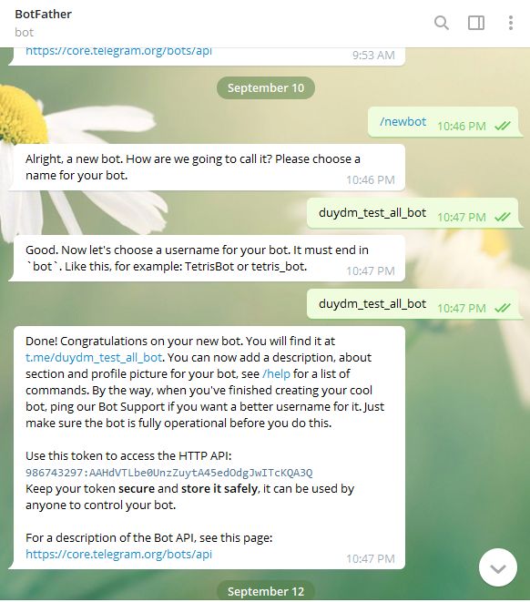
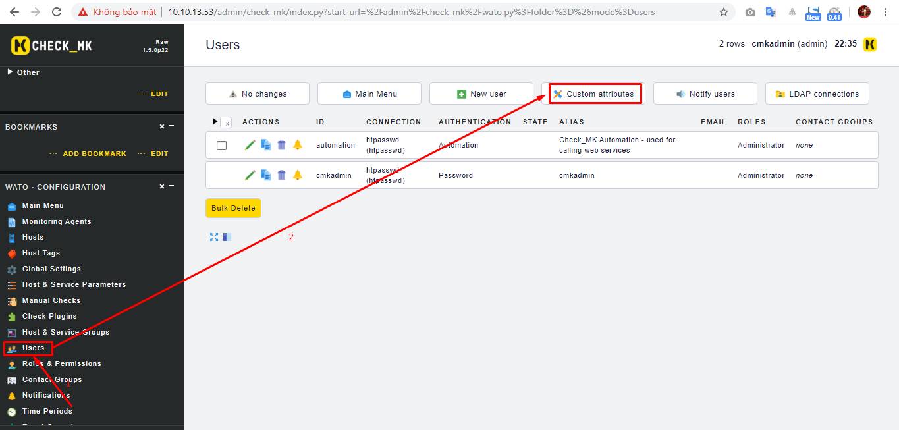
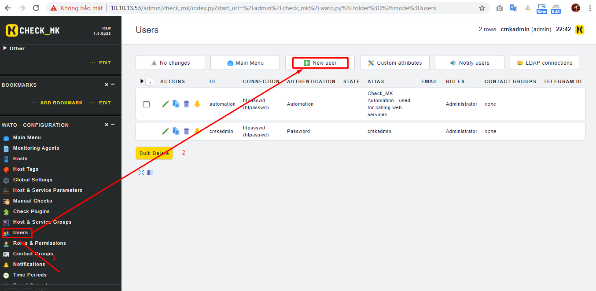
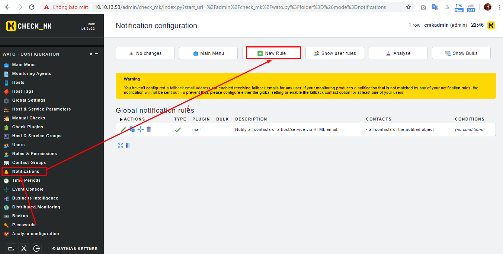
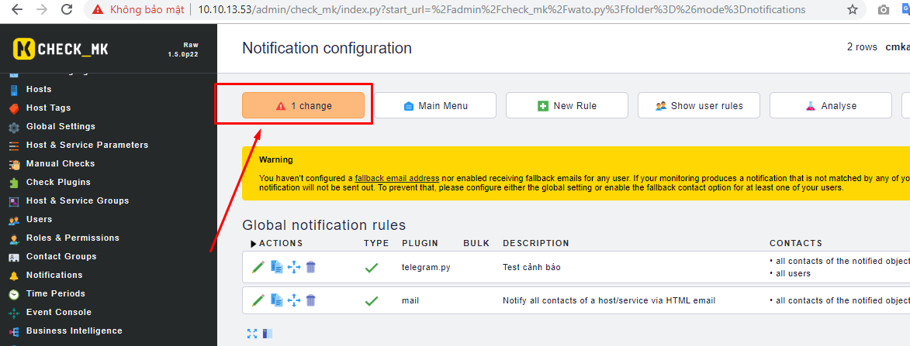
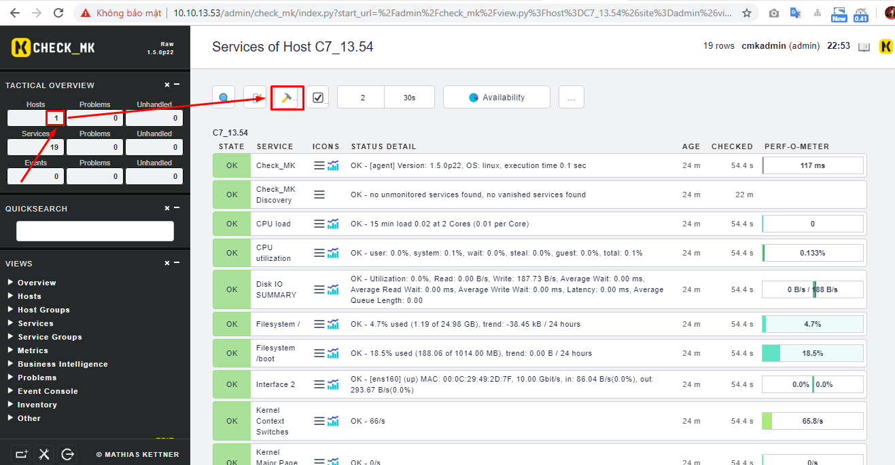
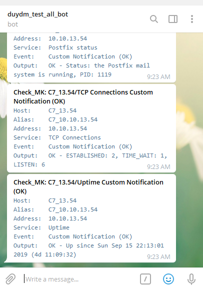

# Ghi chép lại các bước setup cảnh báo check_mk bởi telegram


### 1. Tạo bot telegram và tìm ID user

- Tạo bot telegram để hiển thị cảnh bảo gửi từ check_mk server về.

Truy cập đường link `https://telegram.me/botfather` để mở botfather


Thực hiện các bước sau

```
/newbot
```

Đặt tên cho bot 

```
duydm_test_all_bot
```

Xác nhận: Chú ý phải có hậu tố `_bot` ở sau tên thì mới tạo được botfather

```
duydm_test_all_bot
```

Bạn sẽ nhận được thông tin con bot telegram của mình, lưu giữ lại chuỗi token.




- Xác định ID user

Để người dùng bất kỳ nào có thể nhận được cảnh báo thì user phải chat vào con bot đó và từ đó ta sẽ lấy được ID của người dùng đó để thiết lập cảnh báo trên check_mk.

```
https://api.telegram.org/bottokencuaban/getUpdates
```


### 2. Cấu hình trên check_mk server

**2.1.Tạo ra file telegram.py**

Tạo file với nội dung ở dưới

```
vi /omd/sites/admin/share/check_mk/notifications/telegram.py
```

Lưu ý: Trên đường dẫn tạo file ở trên `admin` chính là site của bạn.

Thay thế `token_cua_ban` bằng token con bot hiên thị cảnh báo

```
#!/usr/bin/env python
# Telegram V2

# Copyright Mathias Kettner  2013  mk@mathias-kettner.de
#           Stefan Gehn      2016  stefan+cmk@srcxbox.net

# check_mk is free software;  you can redistribute it and/or modify it
# under the  terms of the  GNU General Public License  as published by
# the Free Software Foundation in version 2.  check_mk is  distributed
# in the hope that it will be useful, but WITHOUT ANY WARRANTY;  with-
# out even the implied warranty of  MERCHANTABILITY  or  FITNESS FOR A
# PARTICULAR PURPOSE. See the  GNU General Public License for more de-
# ails.  You should have  received  a copy of the  GNU  General Public
# License along with GNU Make; see the file  COPYING.  If  not,  write
# to the Free Software Foundation, Inc., 51 Franklin St,  Fifth Floor,
# Boston, MA 02110-1301 USA.

# Telegram notification based on asciimail notification from
# check_mk 1.2.6p16.

import os
import re
import sys
reload(sys)
sys.setdefaultencoding('utf8')
import urllib
import urllib2
### CHANGE THESE ###
telegram_bot_token = 'token_cua_ban'
####################

tmpl_host_text = """*Check_MK: $HOSTNAME$ - $EVENT_TXT$*
```
Host:     $HOSTNAME$
Alias:    $HOSTALIAS$
Address:  $HOSTADDRESS$
Event:    $EVENT_TXT$
Output:   $HOSTOUTPUT$

$LONGHOSTOUTPUT$```"""

tmpl_service_text = """*Check_MK: $HOSTNAME$/$SERVICEDESC$ $EVENT_TXT$*
```
Host:     $HOSTNAME$
Alias:    $HOSTALIAS$
Address:  $HOSTADDRESS$
Service:  $SERVICEDESC$
Event:    $EVENT_TXT$
Output:   $SERVICEOUTPUT$

$LONGSERVICEOUTPUT$```"""

def substitute_context(template, context):
    # First replace all known variables
    for varname, value in context.items():
        template = template.replace('$'+varname+'$', value)

    # Remove the rest of the variables and make them empty
    template = re.sub("\$[A-Z_][A-Z_0-9]*\$", "", template)
    return template

def construct_message_text(context):
    notification_type = context["NOTIFICATIONTYPE"]
    if notification_type in [ "PROBLEM", "RECOVERY" ]:
        txt_info = "$PREVIOUS@HARDSHORTSTATE$ -> $@SHORTSTATE$"
    elif notification_type.startswith("FLAP"):
        if "START" in notification_type:
            txt_info = "Started Flapping"
        else:
            txt_info = "Stopped Flapping ($@SHORTSTATE$)"
    elif notification_type.startswith("DOWNTIME"):
        what = notification_type[8:].title()
        txt_info = "Downtime " + what + " ($@SHORTSTATE$)"
    elif notification_type == "ACKNOWLEDGEMENT":
        txt_info = "Acknowledged ($@SHORTSTATE$)"
    elif notification_type == "CUSTOM":
        txt_info = "Custom Notification ($@SHORTSTATE$)"
    else:
        txt_info = notification_type # Should neven happen

    txt_info = substitute_context(txt_info.replace("@", context["WHAT"]), context)

    context["EVENT_TXT"] = txt_info

    if context['WHAT'] == 'HOST':
        tmpl_text = tmpl_host_text
    else:
        tmpl_text = tmpl_service_text

    return substitute_context(tmpl_text, context)

def fetch_notification_context():
    context = {}
    for (var, value) in os.environ.items():
        if var.startswith("NOTIFY_"):
            context[var[7:]] = value.decode("utf-8")
    return context

def send_telegram_message(token, chat_id, text):
    url = 'https://api.telegram.org/bot%s/sendMessage' % (token)
    data = urllib.urlencode({'chat_id':chat_id, 'text':text, 'parse_mode':'Markdown'})
    #print("sending telegram message, url '%s', chat id '%s', text '%s'" % (url, chat_id, text))
    try:
        urllib2.urlopen(url, data).read()
    except urllib2.URLError, e:
        sys.stdout.write('Cannot send Telegram message: HTTP-Error %s %s\n' % (e.code, e))

def main():
    context = fetch_notification_context()
    telegram_chatid = context.get('CONTACT_TELEGRAM_CHAT_ID')
    if not telegram_chatid: # e.g. empty field in user database
        sys.stdout.write("Cannot send Telegram message: Empty destination chat id")
        sys.exit(2)
    text = construct_message_text(context)
    send_telegram_message(telegram_bot_token, telegram_chatid, text)

main()


```

- Change quyền

```
chmod +x /omd/sites/admin/share/check_mk/notifications/telegram.py
```

- Restart lại omd server

```
omd restart
```

**2.2. Cấu hình trên WATO giao diện web check_mk server**


- Tạo `Attributes User`

Click `Users` -> `Custom attributes`



Click `Attribute`


Nhập các thông tin chính xác sau:

```
Name: TELEGRAM_CHAT_ID
Title: Telegram ID
Topic: Lựa chọn Identity
Tích chọn: Users can change this attribute in their personal settings, Show the setting of the attribute in the list table, Make this variable available in notifications
```


- Tạo user muốn nhận cảnh báo

Click `User` -> `New user`



Nhập thông tin user mới lưu ý nhập chính xác `ID telegram` của user.


- Tạo rule cảnh báo

Click `Notification` -> `New Rule`



Ta có thể tùy chỉnh rất mạnh ở đây ví dụ như gửi cảnh báo tới ai, tới nhóm nào, xảy ra bởi sự kiện nào...


Lưu ý: `Notification Method` lựa chọn `Gui Canh Bao Telegram`

Xác nhận thay đổi sau mỗi lần thay đổi cấu hình 



- Gửi test cảnh báo






Như vậy đã thiết lập cảnh báo check_mk qua telegram thành công.


