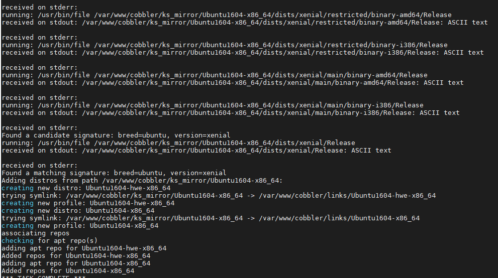
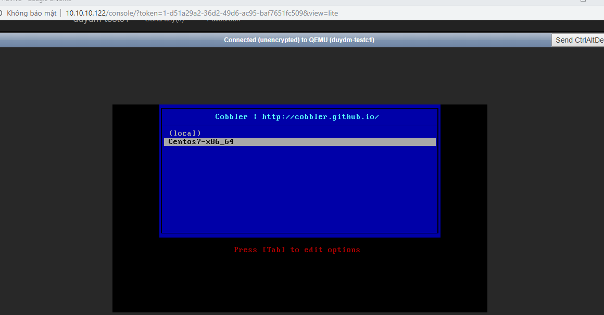
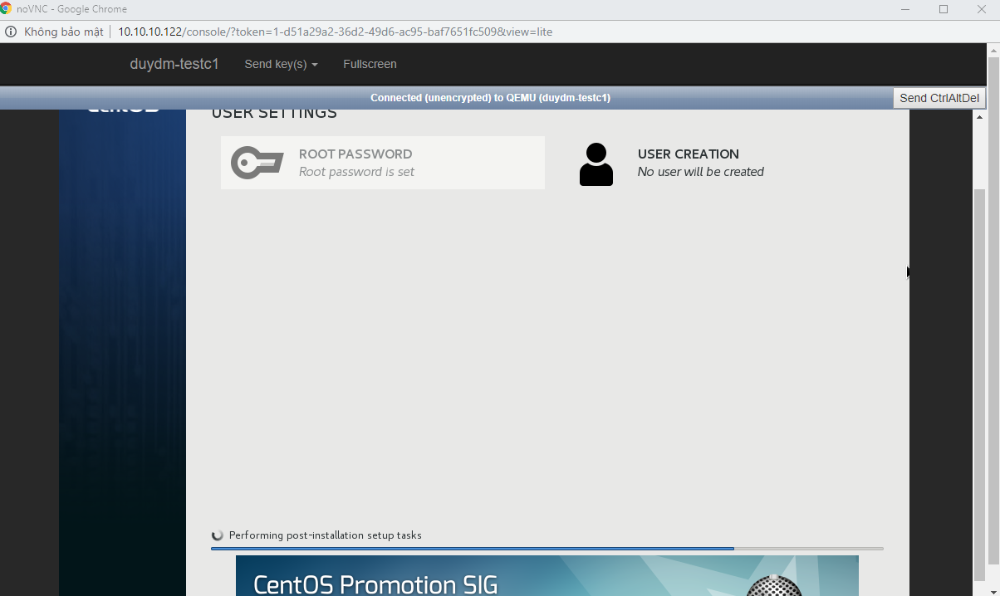

# Cấu hình file cobbler kickstart cho hệ điều hành CentOS, Ubuntu

### Mục lục

[1. Cài đặt cobbler](#caidat)<br>
[2. Import các hệ điều hành](#import)<br>
[3. File kickstart CentOS](#centos)<br>
[4. File kickstart Ubuntu](#ubuntu)<br>

<a name="caidat"></a>
## 1. Cài đặt cobbler

Tham khảo cài đặt [tại đây](https://github.com/domanhduy/ghichep/blob/master/DuyDM/Cobbler/docs/2.Cai-dat-Cobbler-CentoOS7.md)

<a name="import"></a>
## 2. Import các hệ điều hành

- Download file iso của các hệ điều hành muốn trển khai về, download Ubuntu Server 16.04 và Centos 7. Có thể download online hoặc có file iso bạn đẩy lên cobbler server


- Thực hiện mount iso và import vào Cobbler

+ CentOS

```
mkdir /mnt/centos7
mount -o loop CentOS-7-x86_64-Minimal-1804.iso /mnt/centos7
cobbler import --arch=x86_64 --path=/mnt/centos7 --name=Centos7
```


+ Ubuntu

```
mkdir /mnt/ubuntu1604
mount -o loop ubuntu-16.04.5-server-amd64.iso /mnt/ubuntu1604
cobbler import --arch=x86_64 --path=/mnt/ubuntu1604 --name=Ubuntu1604
```


+ Trong quá trình import, nếu có lỗi xảy ra thì thực hiện lệnh



```
cobbler signature update
```


- Thực hiện `umount` khi `import` xong:

```
umount /mnt/ubuntu1604
umount /mnt/centos7
```

<a name="centos"></a>
## 3. File kickstart CentOS

- Tạo file centos7-1804.ks trong thư mục `/var/lib/cobbler/kickstarts` với nội dung:

Một phần cần chú ý là khi cài CentOS phần chia phân vùng ổ cứng có thể chia `/` là Standard hoặc LVM

+ CentOS kickstarts LVM [tại đây](https://github.com/domanhduy/ghichep/blob/master/DuyDM/Cobbler/scripts/kickstart-file/centos7.ks)


+ CentOS kickstarts Standard [tại đây](https://github.com/domanhduy/ghichep/blob/master/DuyDM/Cobbler/scripts/kickstart-file/centos7-sta.ks)

**Lưu ý**: Khi viết file kickstart cài centos theo LVM, đoạn cấu hình LVM:

```
part /boot --fstype ext4 --size=512 --asprimary
part pv.4 --size=1 --grow --ondisk=vda
volgroup VolGroup00 pv.4
logvol swap --fstype swap --name=LogVol00 --vgname=VolGroup00 --recommended
logvol / --fstype xfs --name=LogVol01 --vgname=VolGroup00 --size=1 --grow
```

`pv.01` là chuẩn nhưng có thể thay đổi thành `pv.<string>`
Nhưng nếu bạn ko có dấu `.`  như pv4 thì hệ thống boot OS trên Client sẽ báo lỗi không tạo được pv4.

- Tạo profile tên Centos7-auto trên giao diện web cobbler


-  Centos 7, tên card mạng được đặt theo tên kiểu mới `enoxxx` có thể đổi sang `ethxxx`

+ Trên giao diện web: Thêm tùy chọn `biosdevname=0 net.ifnames=0` vào tùy chọn kernel options trong profile của Centos 7.

+ Trong phần cấu hình bootloader, thêm tùy chọn `--append="biosdevname=0 net.ifnames=0"` vào để kernel hiểu interface name. Sửa trong file kickstart tại vị trí cấu hình bootloader như sau:

```
bootloader --location=mbr --append="biosdevname=0 net.ifnames=0"
```

- Nếu có chỉnh sửa file kickstart cần đồng bộ và cập nhật file kickstart cho profile của Centos
```
cobbler profile edit --name=Centos7-x86_64 --kickstart=/var/lib/cobbler/kickstarts/centos7.ks
```

- Test tạo máy ảo CentOS thông qua cobbler





Chờ để tiến trình cài đặt OS cho client thành công.


<a name="ubuntu"></a>
## 4. File kickstart Ubuntu


