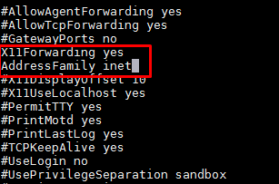
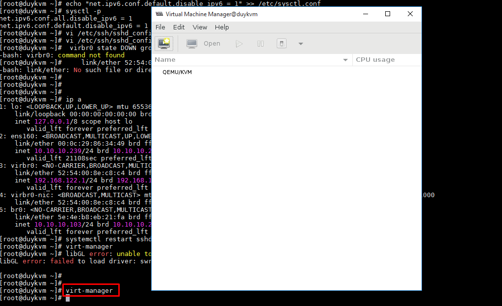

# Hướng dẫn cài đặt KVM server trên môi trường VMware ESXi

## A, Môi trường thực hiện LAB

Máy ảo trên node VMware ESXi có cấu hình:

+ KVM node OS: CentOS 7 bản 1804 (Chạy trên ESXi)

+ RAM: >8G

+ Disk: 200G

+ CPU: 4x2 Core

Cài đặt: Setup Ip tĩnh, disable firewall, selinux, update, kiểm tra kết nối internet

## B, Mô hình


## C, Các bước cài đặt

**Bước 1**: Bật chế độ ảo hóa trong vm trên ESXi

- Sau khi cài đặt xong CentOS 7 tiến hành shutoff và cấu hình enable vmx cho KVM Node trên ESXi Node

+ Shutdown VM --> SSH to ESXi --> go to folder --> edit VM-name.vmx --> Add line
vhv.enable = "TRUE"

Sau khi SSH vào node vmware di chuyển tới thư mục: `/vmfs/volumes/devices`. Bên trong này sẽ chứa tất cả các file của VM được tạo.

```sh
cd /vmfs/volumes/devices/Name_VMVKM
```


Edit VM-name.vmx

```sh
vi VM-name.vmx

Add thêm dòng sau vào cuối file

vhv.enable = "TRUE"
```


+ Kiểm tra ID của VM và reload lại VM vừa sửa file VM-name.vmx

```sh
vim-cmd vmsvc/getallvms | grep -i <name> 
vim-cmd vmsvc/reload <id>
```


**Bước 2**: Kiểm tra chế độ ảo hóa của VM

Bật máy ảo KVM lên và kiểm tra


Nếu OUTPUT câu lệnh trên >0 thì đã enable vmx OK

**Bước 3**: Cài đặt Vm tools và các package để đóng image
```sh
yum install -y open-vm-tools wget

grep -E '(vmx|svm)' /proc/cpuinfo

yum install -y qemu-kvm qemu-img virt-manager libvirt libvirt-python libvirt-client virt-install virt-viewer bridge-utils  "@X Window System"xorg-x11-xauth xorg-x11-fonts-* xorg-x11-utils mesa-libGLU*.i686 mesa-libGLU*.x86_64

touch /root/.Xauthority
systemctl start libvirtd
systemctl enable libvirtd
lsmod | grep kvm

yum install dejavu-lgc-sans-fonts -y

```
**Bước 4:** Tạo Bridge br0 cho KVM host để đóng Images thay vì sử dụng NAT trên virtbr0 có sẵn.

```sh
nmcli c add type bridge autoconnect yes con-name br0 ifname br0

nmcli c add type bridge autoconnect yes con-name br0 ifname br0

nmcli c modify br0 ipv4.addresses 10.10.10.61/24 ipv4.method manual

nmcli c modify br0 ipv4.gateway 10.10.10.1

nmcli c modify br0 ipv4.dns 8.8.8.8

nmcli c delete ens160

Lưu ý: Khi delete card mạng thì phải ssh lại

nmcli c add type bridge-slave autoconnect yes con-name ens160 ifname ens160 master br0
```


```sh
echo "net.ipv6.conf.all.disable_ipv6 = 1" >> /etc/sysctl.conf
echo "net.ipv6.conf.default.disable_ipv6 = 1" >> /etc/sysctl.conf
sysctl -p
```
 
**Bước 5:** Enable X11Forwarding
```sh
vi /etc/ssh/sshd_config

+ Edit 

X11Forwarding yes

+ Thêm dòng sau ở ngay dưới câu lệnh trên.

AddressFamily inet

+ Restart service ssh

```



**Bước 6**: Thực thi lệnh chạy KVM hiển thị GUI

```sh
virt-manger
```
Giao diện GUI cho phép tạo máy ảo được hiện lên.




## D. Link tham khảo

https://github.com/uncelvel/create-images-openstack/blob/master/docs/Prepare.md


