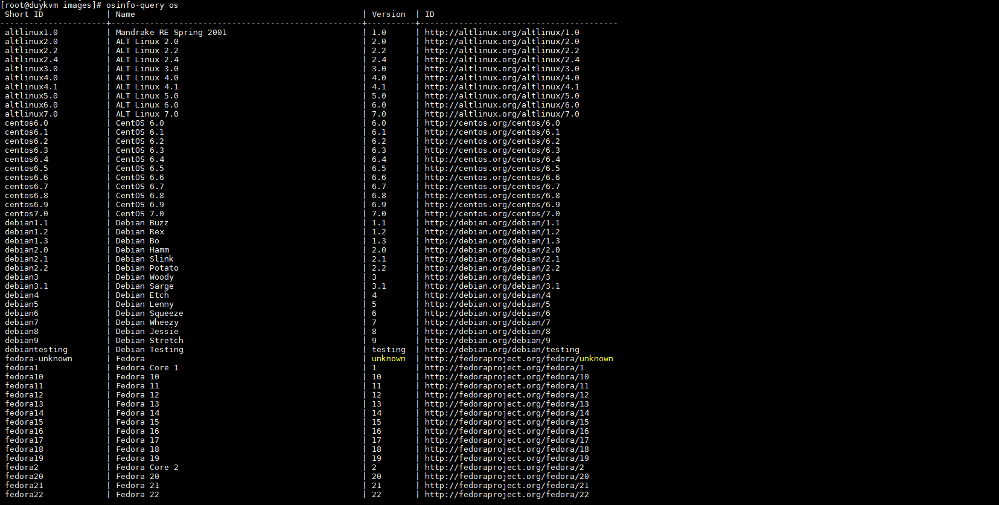
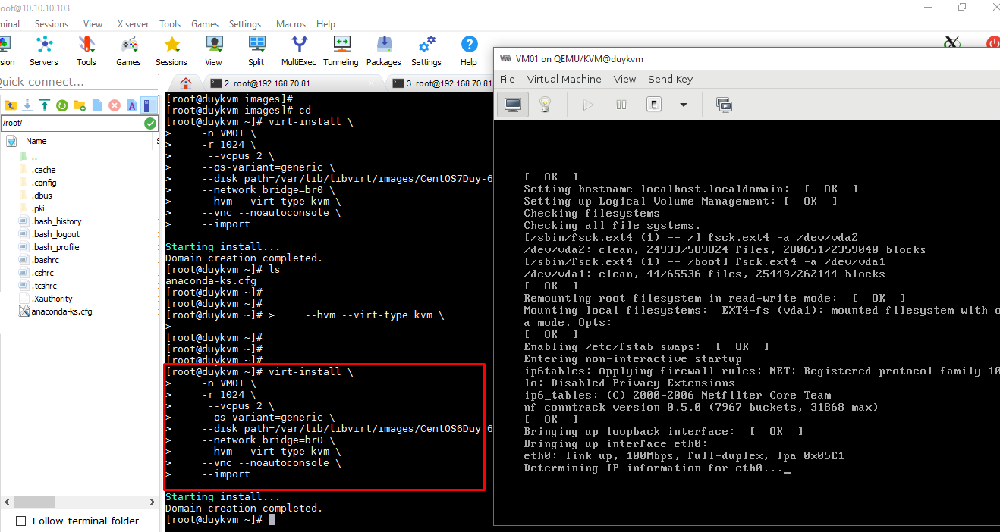
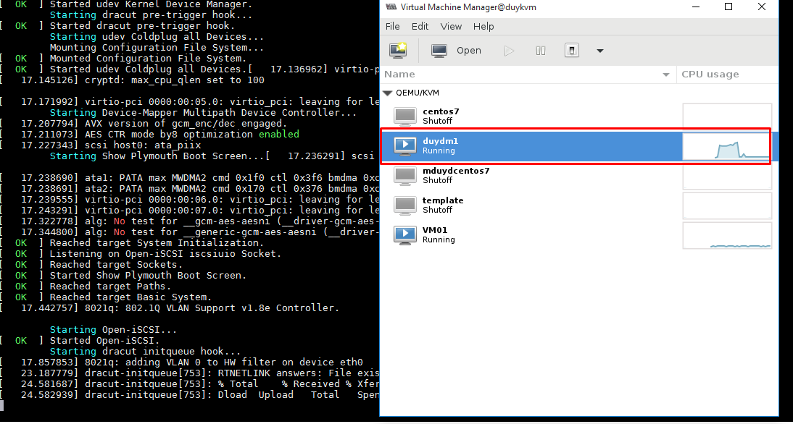
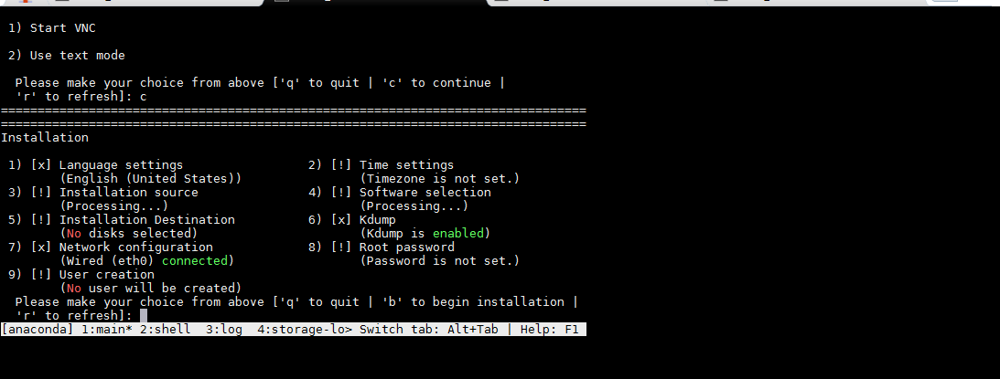
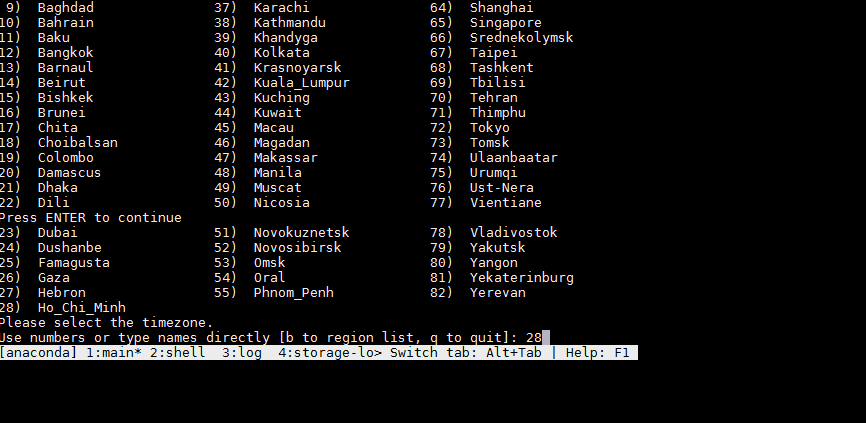
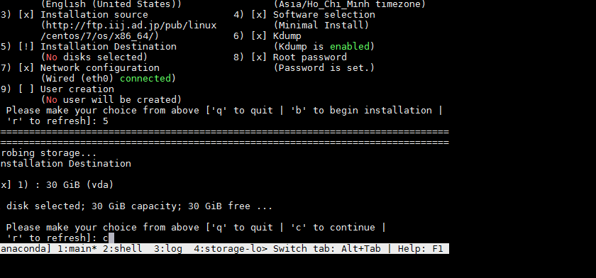
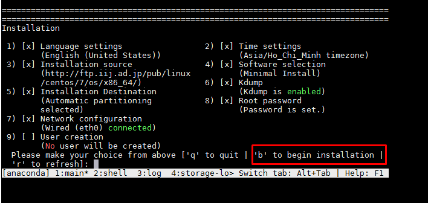
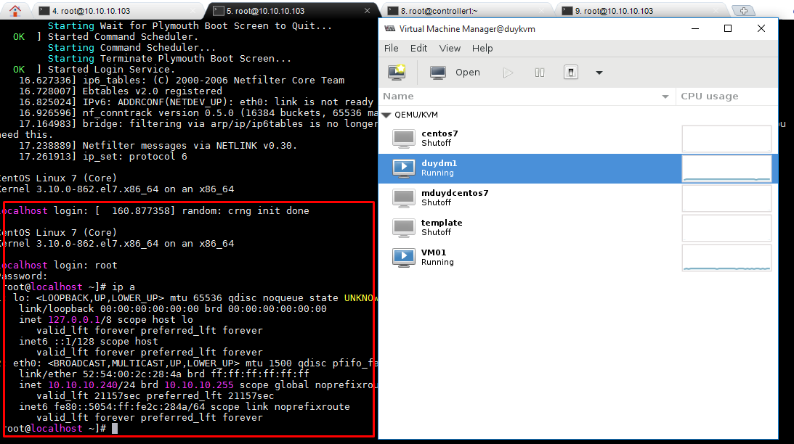

# Create virtual machine (CLI)

### Mục lục

[1, Môi trường thực hiện LAB](#moitruong)

[2, Mô hình](#mohinh)

[3, Các bước thực hiện](#step)

[4, GuestOS to HostOS](#os)

<a name="moitruong"></a>
## 1. Môi trường thực hiện LAB

- KVM server

<a name="mohinh"></a>
## 2, Mô hình


<a name="step"></a>
## 3. Các bước thực hiện

- virt-install là công cụ command line dùng cho việc tạo máy ảo trên KVM sử dụng thư viện quản lí "libvirt".

- virt-install hỗ trợ cả dạng text lẫn đồ họa, người sử dụng có thể lựa chọn giữa VNC - SDL cho chế độ cài đồ họa hoặc text console. Bên cạnh đó, bạn cũng có thể lựa chọn cài đặt dùng 1 hoặc nhiều các thành phần như virtual disks, card mạng, ...

- virt-install có thể lấy các file cài đặt từ trên NFS, HTTP, FTP servers để tiến hành cài máy ảo. Bên cạnh đó, nó cũng cho phép sử dụng PXE booting hoặc file image.

- Chỉ cần nhập đúng những dòng lệnh, virt-install sẽ tự động cài đặt máy ảo mà không cần sự giám sát. Nó cũng có chế độ tương tác với option --prompt nhưng virt-install sẽ chỉ yêu cầu những tùy chọn tối thiểu.

### 3.1. Tạo từ file ISO
 
Bước 1: Tạo một thư mục (pool) để lưu trữ máy ảo
	```sh
	mkdir -p /var/kvm/../images
	```
	
	
Bước 2: Sử dụng lệnh `virt-install` với các tham số + giá trị truyền vào để tạo máy ảo với thông tin cấu hình mong muốn.

Hầu hết các options là không bắt buộc, virt-install chỉ yêu cầu 1 số thông số tối thiểu sau:

```sh
--name
--ram
--disk
--filesystem or --nodisks
```

Các tham số đối với `virt-install`
	
--name: Đặt tên cho máy ảo

--ram: Set dung lượng RAM cho máy ảo (MB)

--disk path=xxx ,size=xxx

	+ path: Đường dẫn lưu trữ file img máy ảo .img, size: dung lượng disk mount
	
--vcpus: Set giá trị số vCPU

--os-type: kiểu hệ điều hành (linux, windows)

--os-variant: Kiểu của GuestOS . Check bằng lệnh

```sh
osinfo-query os
```

	

--network: Dải network mà máy ảo tạo ra sẽ cắm vào.

--graphics: Set chế độ đồ họa, đặt là none -> không sử dụng chế độ đồ họa.

--console: Lựa chọn kiểu console

--location: Đường dẫn tới file cài đặt

--extra-args: Set tham số cho kernel

Ở đây tìm hiểu một số tham số cơ bản, ngoài ra virst-install còn nhiều tham số khá `virt-install --help` để sử dụng các tham số khác.
	
Ví dụ: Với tham số cơ bản của một máy ảo

```sh
virt-install \
--name centos7 \
--ram 2048 \
--disk path=/var/kvm/images/duydmcentos7.img,size=30 \
--network bridge=br0 \
--graphics vnc,listen=0.0.0.0 \
--noautoconsole \
--os-type=linux \
--os-variant=rhel7 \   
--location=/var/lib/libvirt/images/CentOS-7-x86_64-Minimal-1804.iso
```
	

	

	


Tiến hành cài đặt các bước như bình thường.

### 3.2. Tạo từ file image

```sh
virt-install \
    --name VMduy \
    --ram 1024 \
	--vcpus 1 \
    --os-variant=rhel7 \
    --disk path=/var/lib/libvirt/images/CentOS7Duy-64bit-2018.img,format=qcow2,bus=virtio,cache=none \
    --network bridge=br0 \
    --hvm --virt-type kvm \
    --vnc --noautoconsole \
    --import
```



### 3.3. Tạo từ internet

```sh
virt-install \
  --name duydm1 \
  --ram 2048 \
  --disk path=/var/kvm/images/duydm1.img,size=30 \
  --vcpus 2 \
  --os-type linux \
  --os-variant rhel7  \
  --network bridge=br0 \
  --graphics none \
  --console pty,target_type=serial \
  --location 'http://ftp.iij.ad.jp/pub/linux/centos/7/os/x86_64/' \
  --extra-args 'console=ttyS0,115200n8 serial'
```
















<a name="os"></a>
## 4, GuestOS to HostOS

Hệ điều hành chủ (host operating system): là hệ điều hành chạy trên máy chủ.

Hệ điều hành khách (guest operating system): là hệ điều hành chạy trên một VM.


	
	