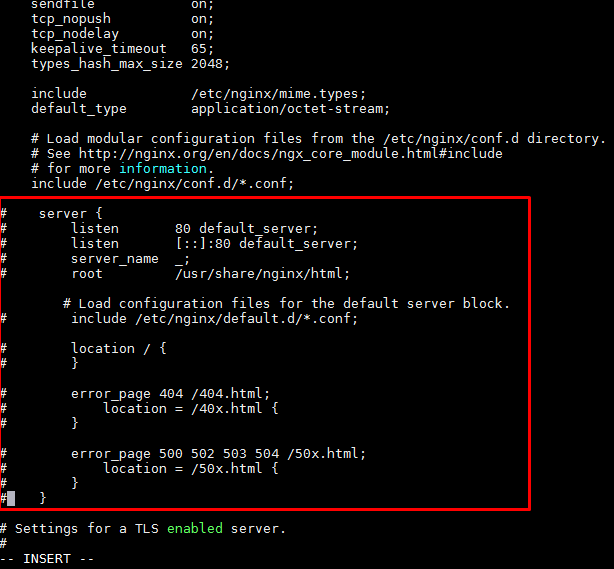

# Hướng dẫn cài đặt webvirt trên CentOS 7

### Mục lục

[1, Chuẩn bị](#chuanbi)

[2, Mô hình](#mohinh)

[3, Các bước cài đặt](#setup)

[4, Link tham khảo](#thamkhao)

<a name="chuanbi"></a>
## 1, Chuẩn bị

- Server webvirt:
	
	+ OS: CentOS 7 bản 1804 (Chạy trên ESXi)

	+ RAM: 4Gb
	
	+ CPU: 2 core
	
	+ Disk: 100Gb
	
	+ Network: 1 interface
	
- Server KVM:

	+ OS: CentOS 7 bản 1804 (Chạy trên ESXi)

	+ RAM: >8G

	+ Disk: 200G

	+ CPU: 4x2 Core
- Thiết lập thông tin cơ bản cho server

```sh
hostnamectl set-hostname webvirtduy1
echo "Setup IP ens160"
nmcli c modify ens160 ipv4.addresses 10.10.10.109/24
nmcli c modify ens160 ipv4.gateway 10.10.10.1
nmcli c modify ens160 ipv4.dns 8.8.8.8
nmcli c modify ens160 ipv4.method manual
nmcli con mod ens160 connection.autoconnect yes

sudo systemctl disable firewalld
sudo systemctl stop firewalld
sed -i 's/SELINUX=enforcing/SELINUX=disabled/g' /etc/sysconfig/selinux
sed -i 's/SELINUX=enforcing/SELINUX=disabled/g' /etc/selinux/config
```

```sh
yum install epel-release
yum update -y
```


<a name="setup"></a>
## 2, Mô hình


<a name="setup"></a>
## 3, Các bước cài đặt

Bước 1: Cài đặt các package cần thiết

```sh
yum install epel-release
yum -y install git python-pip libvirt-python libxml2-python python-websockify supervisor nginx
yum -y install gcc python-devel
pip install numpy
```

Bước 2: Thiết lập thư mục cho webvirt, python và môi trường Django

```sh
mkdir /var/www/ 
cd /var/www
```


- Trong thư mục www vừa tạo clone thư viện webvirt về:

```sh
git clone git://github.com/retspen/webvirtmgr.git
```


- Đảm bảo các file trong `webvirtmgr` đầy đủ


- Cài đặt môi trường cho webvirt

```sh
cd webvirtmgr
sudo pip install -r requirements.txt
```


- Đồng bộ đb

```sh
./manage.py syncdb
```


Username/Pass chính là nhập thông tin tài khoản để login vào webvirt

- Thu thập thông tin db

```sh
./manage.py collectstatic
```


Bước 3: Cấu hình nginx

Tạo file config webvirtmgr trong ngĩn config

```sh
vi /etc/nginx/conf.d/webvirtmgr.conf

Add nội dung

server {
    listen 80 default_server;

    server_name $hostname;
    #access_log /var/log/nginx/webvirtmgr_access_log; 

    location /static/ {
        root /var/www/webvirtmgr/webvirtmgr; # or /srv instead of /var
        expires max;
    }

    location / {
        proxy_pass http://127.0.0.1:8000;
        proxy_set_header X-Real-IP $remote_addr;
        proxy_set_header X-Forwarded-for $proxy_add_x_forwarded_for;
        proxy_set_header Host $host:$server_port;
        proxy_set_header X-Forwarded-Proto $scheme;
        proxy_connect_timeout 600;
        proxy_read_timeout 600;
        proxy_send_timeout 600;
        client_max_body_size 1024M; # Set higher depending on your needs 
    }
}
```


- Chỉnh sửa config nginx

```sh
vi /etc/nginx/nginx.conf
```

Comment lại khối server

```sh
#    server {
#        listen       80 default_server;
#        listen       [::]:80 default_server;
#        server_name  _;
#        root         /usr/share/nginx/html;
#
        # Load configuration files for the default server block.
#        include /etc/nginx/default.d/*.conf;

#        location / {
#        }

#        error_page 404 /404.html;
#            location = /40x.html {
#        }

#        error_page 500 502 503 504 /50x.html;
#            location = /50x.html {
#        }
#    }
```


- Khởi động lại service nginx

```sh
systemctl restart nginx
systemctl enable nginx
chkconfig supervisord on
```


Bước 4: Cấu hình supervisor

```sh
sudo chown -R nginx:nginx /var/www/webvirtmgr
```
 Tạo file webvirtmgr.ini

```sh
vi /etc/supervisord.d/webvirtmgr.ini

Add nội dung

[program:webvirtmgr]
command=/usr/bin/python /var/www/webvirtmgr/manage.py run_gunicorn -c /var/www/webvirtmgr/conf/gunicorn.conf.py
directory=/var/www/webvirtmgr
autostart=true
autorestart=true
logfile=/var/log/supervisor/webvirtmgr.log
log_stderr=true
user=nginx

[program:webvirtmgr-console]
command=/usr/bin/python /var/www/webvirtmgr/console/webvirtmgr-console
directory=/var/www/webvirtmgr
autostart=true
autorestart=true
stdout_logfile=/var/log/supervisor/webvirtmgr-console.log
redirect_stderr=true
user=nginx

```

```sh
systemctl stop supervisord
sudo systemctl start supervisord
```

Bước 5: Update thay đổi trong webvirtmgr

```sh
cd /var/www/webvirtmgr
git pull
./manage.py collectstatic
systemctl restart supervisord
```


Bước 6: Debug

```sh
./manage.py runserver 0:8000
```


Bước 7: Truy cập giao diện websockify

```sh
http://ip_server_webvirt
```
- Truy cập webvirt thành công


- Nhập thông tin đăng nhập


Ở đây có thể thao tác add host KVM vào để quản lý qua giao diện web.


<a name="thamkhao"></a>
## 4, Link tham khảo

https://github.com/retspen/webvirtmgr/wiki/Install-WebVirtMgr

https://github.com/doxuanson/thuctap012017/blob/master/XuanSon/Virtualization/Virtual%20Machine/KVM/Tool%20use%20KVM.md#3.3

https://github.com/meditechopen/meditech-thuctap/blob/master/MinhNV/KVM/docs/th%E1%BB%B1c%20h%C3%A0nh/install_webvirt_U14.md
