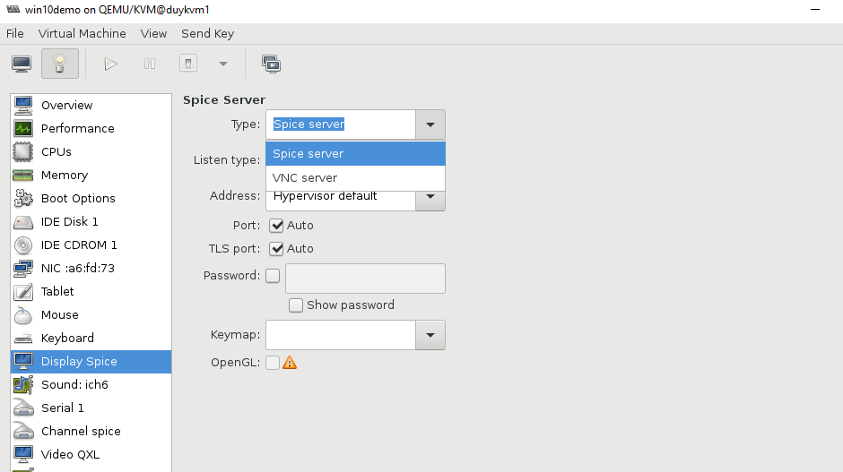
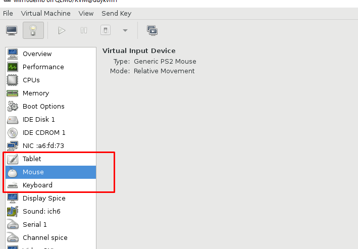

# Một số tham số virt

### Tham số cơ bản của một máy ảo khi khởi tạo

Để có thể khởi tạo một VM trên KVM có nhiều cách, sử dụng CLI cũng có thể khỏi tại VM nhưng đòi hỏi phải nhập đúng thông tin trong câu lệnh.

## 1. Tham số không bắt buộc

- Hiển thị thông tin version của virt-install

```
virt-install --version
```

- Xem gợi ý tham số truyền vào lệnh

```
virt-install --help
```
## 2. Tham số chung virt-install --<arguments>

- Đặt tên cho VM

```
--n NAME 
```
- Phân bổ dung lượng RAM

```
--memory MEMORY
```
Phân bổ theo đơn vị Megabyte
--memory 1024 (MiB)
--memory 512,maxmemory=1024
--memory 512,maxmemory=1024,hotplugmemorymax=2048,hotplugmemoryslots=2

- Set thông số cho CPU

```
--vcpus VCPUS
```

Số lượng vCPU cấu hình cho VM
--vcpus 5
--vcpus 5,maxcpus=10,cpuset=1-4,6,8
--vcpus sockets=2,cores=4,threads=2

- Set metadata cho VM

```
--metadata METADATA   
```

--metadata name=duy,title="ddd",uuid=...
--metadata description="demo"

## 3. Phương thức cài đăt

Để khởi tạo cài đặt OS cho VM có thể lựa chọn một trong các phương thức cài đặt phổ biến ở dưới.

--cdrom CDROM: Cài đăt bằng CR-ROM

--location LOCATION: Cài đặt từ một thư mục nào đó chưa file cài đặt, location chính là đường dẫn tới file cài đặt.

--pxe : Boot từ netwỏk để cài đặt.

--import : Cài đặt bằng cách import từ file image có sẵn

--extra-args EXTRA_ARGS: Bổ sung các tham số cho kernel đối với kiểu cài đặt từ --localtion

vd: console=ttyS0,115200n8 serial

--initrd-inject INITRD_INJECT: Thêm một file tới root của inintrd đối với phương thức cài đặt --localtion

INITRD cung cấp một tập các chương trình nhỏ sẽ được thực thi khi kernel vừa mới được khởi chạy.

--os-variant DISTRO_VARIANT: Kiểu của GuestOS . Check bằng lệnh `osinfo-query os`

--boot BOOT: Cấu hình boot cho VM

VD:	--boot hd,cdrom,menu=on (Bật order boot và boot từ hard disk trước cdrom).
	
## 4. Device options

--disk DISK: Chỉ định dung lượng disk với nhiều tùy chọn khác nhau.

		--disk size=10 (khai báo một disk có dung lượng 10Gb đối với phương thức --location)
		--disk /path/disk,cache=none (đi tới một file disk đã có)
		--disk device=cdrom,bus=scsi (khai báo kiểu cho disk)

--network NETWORK: Cấu hình network interface cgi VM

		--network bridge=mybr0 (kiểu bridge tới qua interface)
		--network network=my_libvirt_virtual_net (chỉ định device name của network của một card bridge nào đó)
		--network network=mynet,model=virtio,mac=00:11...(Chỉ định một network với name, model, mac)
		--network none
		--network help


--graphics GRAPHICS: Cấu hình hiển thị VM

		--graphics vnc
		--graphics spice,port=5901,tlsport=5902
		--graphics none
		--graphics vnc,password=xxxxx,port=5910,keymap=ja
		


--input INPUT: Cài đặt thông tin về thiết bị đầu vào như usb, bàn phím..

		--input tablet
		--input keyboard,bus=usb
		


--serial SERIAL: Cấu hình serial VM
--parallel PARALLEL
--channel CHANNEL
--console CONSOLE: Cấu hình kết nối console giữa VM và host.


## 5. Virtualization Platform 

-v, --hvm : Full virtualized guest

-p, --paravirt: Paravirtualized guest

--container : Container guest

--virt-type HV_TYPE   Hypervisor name (kvm, qemu, xen, ...)

## 6. Tùy chọn khác

--autostart: Auto bật khi cài xong

--wait WAIT

--noautoconsole: Không tự động console tới VM

--noreboot: Không tự động reboot sau khi cài đặt xong.


		

		


## Ví dụ

```sh
virt-install \
--name centos7 \
--ram 2048 \
--disk path=/var/kvm/images/duydmcentos7.img,size=30 \
--network bridge=br0 \
--graphics vnc,listen=0.0.0.0 \
--noautoconsole \
--os-type=linux \
--os-variant=rhel7 \   
--location=/var/lib/libvirt/images/CentOS-7-x86_64-Minimal-1804.iso
```

--name: Đặt tên cho máy ảo

--ram: Set dung lượng RAM cho máy ảo (MB)

--disk path=xxx ,size=xxx

	+ path: Đường dẫn lưu trữ file img máy ảo .img, size: dung lượng disk mount
	
--vcpus: Set giá trị số vCPU

--os-type: kiểu hệ điều hành (linux, windows)

--os-variant: Kiểu của GuestOS . Check bằng lệnh `osinfo-query os`

--network: Dải network mà máy ảo tạo ra sẽ cắm vào.

--graphics: Set chế độ đồ họa, đặt là none -> không sử dụng chế độ đồ họa.

--console: Lựa chọn kiểu console

--location: Đường dẫn tới file cài đặt

--extra-args: Set tham số cho kernel

