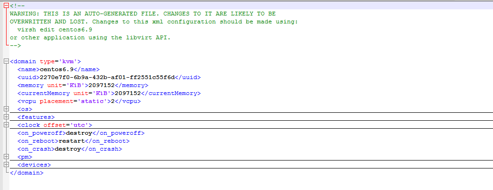
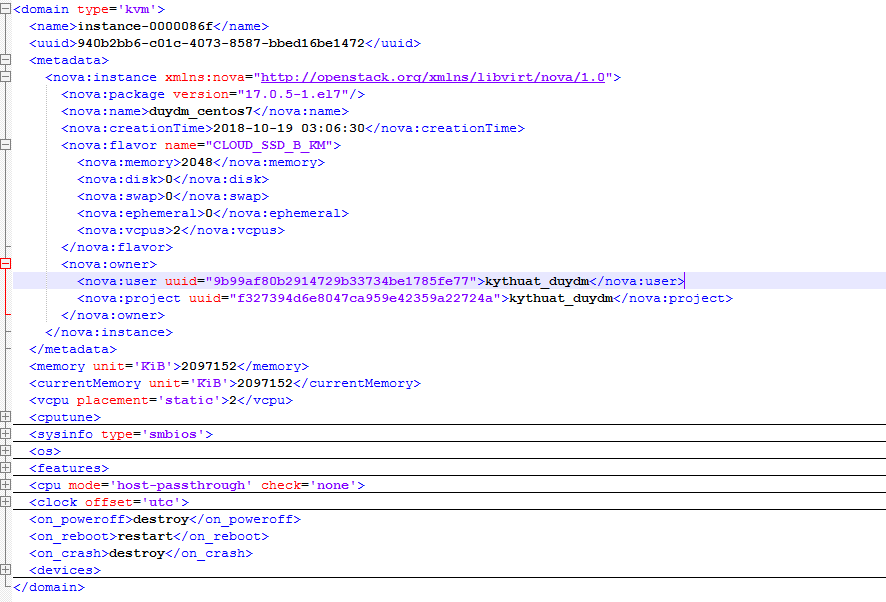

# Tìm hiểu về file XML trong KVM

### Mục lục

[1. Tổng quan về file XML](#tongquan)

[2. Các thành phần của file XML](#thanhphan)

[3. Tạo máy ảo từ file XML](#vmxml)

<a name="tongquan"></a>

## 1, Tổng quan về file XML

- VM trong KVM có hai thành phần chính đó là VM's definition được lưu dưới dạng file XML mặc định ở thư mục /etc/libvirt/qemu và VM's storage lưu dưới dạng file image.

- File domain XML chứa những thông tin về thành phần của máy ảo (số CPU, RAM, các thiết lập của I/O devices...)

- libvirt dùng những thông tin này để tiến hành khởi chạy tiến trình QEMU-KVM tạo máy ảo.

- KVM cũng có các file XML khác để lưu các thông tin liên quan tới network, storage...

- Mục đích chính của XML là đơn giản hóa việc chia sẻ dữ liệu giữa các hệ thống khác nhau, đặc biệt là các hệ thống được kết nối với Internet.


<a name="thanhphan"></a>
## 2, Các thành phần của file XML

File xml nhìn cơ bản có thể thấy tổ chức theo khối lệnh, có nhiều khối lệnh cùng trong 1 khối lệnh tổng quan, cú pháp giống HTML có thẻ đóng, thẻ mở.


Thẻ quan trọng không thể thiếu trong file domain xml là `domain`

+ Tham số `type` cho biết hypervisor đang sử dụng của VM.

- Các tham số bên trong có ý nghĩa như sau:

`name` thông tin về tên VM

```sh
<name>centos7</name>
```

- `uuid` : Mã nhận dạng quốc tế duy nhất cho máy ảo. Format theo RFC 4122. Nếu thiếu trường uuid khi khởi tạo, mã này sẽ được tự động generate.

```sh
<uuid>0b343e4f-fac7-4944-85cc-eee71389a297</uuid>
```
- Một số type khác có thêm thông tin về các tham số như

+ `title` : Tiêu đề của máy ảo.
+ `description` : Đoạn mô tả của máy ảo, nó sẽ không được libvirt sửa dụng.
+ `metadata` : Chứa những thông tin về file xml.

- `memory`: Dung lượng RAM của máy ảo được cấp khi khởi tạo máy.

`unit` : đơn vị, mặc định là KiB (kibibytes = 1024 bytes), có thể sử dụng b (bytes), KB (Kilobytes = 1000 bytes), MB (Megabytes = 1000000 bytes), M hoặc MiB (Mebibytes = 1,048,576 bytes), GB (gigabytes = 1,000,000,000 bytes), G hoặc GiB (gibibytes = 1,073,741,824 bytes), TB (terabytes = 1,000,000,000,000 bytes), T hoặc TiB (tebibytes = 1,099,511,627,776 bytes)

```sh
<memory unit='KiB'>2097152</memory>
```

- `currentMemory`: Dung lượng RAM đang được sử dụng tại thởi điểm trích xuất file XML

```sh
<currentMemory unit='KiB'>2097152</currentMemory>
```

- `maxMemory` : Dung lượng RAM tối đa có thể sử dụng

- `vcpu`: Tổng số vcpu máy ảo được cấp khi khởi tạo.

```sh
<vcpu placement='static'>1</vcpu>
```
vcpu có một số tham số:

+ `cpuset`: danh sách các cpu vật lí mà máy ảo sử dụng

+ `current` : chỉ định cho phéo kích hoặt nhiều hơn số cpu đang sử dụng

+ `placement` : vị trí của cpu, giá trị bao gồm static và dynamic, trong đó static là giá trị mặc định.

-Block OS: Chứa các thông tin về hệ điều hành của máy ảo

```sh
<os>
    <type arch='x86_64' machine='pc-i440fx-rhel7.0.0'>hvm</type>
    <boot dev='hd'/>
</os>
```

`arch`: Hệ điều hành thuộc kiến trúc 32 hay 64 bit

`machine`: Thông tin về kernel của HDH

`loader` : readonly có giá trị yes hoặc no chỉ ra file image writable hay readonly. type có giá trị rom hoặc pflash chỉ ra nơi guest memory được kết nối.

`kernel` : đường dẫn tới kernel image trên hệ điều hành máy chủ

`initrd` : đường dẫn tới ramdisk image trên hệ điều hành máy chủ

`cmdline` : xác định giao diện điều khiển thay thế

- Hành động xảy ra đối với một số sự kiện của OS

```sh
<on_poweroff>destroy</on_poweroff>
<on_reboot>restart</on_reboot>
<on_crash>destroy</on_crash>
```

`on_poweroff` : Hành động được thực hiện khi người dùng yêu cầu tắt máy

`on_reboot` : Hành động được thực hiện khi người dùng yêu cầu reset máy

`on_crash` : Hành động được thực hiện khi có sự cố.

Những hành động được phép thực thi:

+destroy : Chấm dứt và giải phóng tài nguyên

+restart : Chấm dứt rồi khởi động lại giữ nguyên cấu hình

+preserve : Chấm dứt nhưng dữ liệu vẫn được lưu lại

+rename-restart : Khởi động lại với tên mới

+destroy và restart được hỗ trợ trong cả on_poweroff và on_reboot. preserve dùng trong on_reboot, rename-restart dùng trong on_poweroff

- on_crash hỗ trợ 2 hành động:

+ coredump-destroy: domain bị lỗi sẽ được dump trước khi bị chấm dứt và giải phóng tài nguyên

+ coredump-restart: domain bị lỗi sẽ được dump trước khi được khởi động lại với cấu hình cũ

- CPU : Khuyến cáo đối với CPU model, các tính năng và cấu trúc liên kết của nó có thể được xác định bằng cách sử dụng tập hợp các phần tử sau

```sh
...
<cpu match='exact'>
  <model fallback='allow'>core2duo</model>
  <vendor>Intel</vendor>
  <topology sockets='1' cores='2' threads='1'/>
  <cache level='3' mode='emulate'/>
  <feature policy='disable' name='lahf_lm'/>
</cpu>
...
```

```sh
<cpu mode='host-model'>
  <model fallback='forbid'/>
  <topology sockets='1' cores='2' threads='1'/>
</cpu>
```

```sh
<cpu mode='host-passthrough'>
  <cache mode='passthrough'/>
  <feature policy='disable' name='lahf_lm'/>
...
```

cpu là chứa mô tả các yêu cầu của guest CPU. Thuộc tính `match` của nó xác định mức độ lên kết của CPU ảo được cung cấp cho quest phù hợp với các yêu cầu này. Từ phiên bản 0.7.6 thuộc tính match có thể được bỏ qua nếu topo là phần tử duy nhất trong cpu. 

Một số giá trị có thể có cho thuộc tính `match` là:

+minimum: 

+exact: 

+strict:

- clock: Thiết lập về thời gian

```sh
<clock offset='utc'>
    <timer name='rtc' tickpolicy='catchup'/>
    <timer name='pit' tickpolicy='delay'/>
    <timer name='hpet' present='no'/>
</clock>
```

`offset` : giá trị utc, localtime, timezone, variable

- feature: là hypervisors cho phép thao tác một số tính năng như bật/tắt

```sh
...
<features>
  <pae/>
  <acpi/>
  <apic/>
  <hap/>
  <privnet/>
  <hyperv>
    <relaxed state='on'/>
    <vapic state='on'/>
    <spinlocks state='on' retries='4096'/>
    <vpindex state='on'/>
    <runtime state='on'/>
    <synic state='on'/>
    <reset state='on'/>
    <vendor_id state='on' value='KVM Hv'/>
    <frequencies state='on'/>
    <reenlightenment state='on'/>
    <tlbflush state='on'/>
  </hyperv>
  <kvm>
    <hidden state='on'/>
  </kvm>
  <pvspinlock state='on'/>
  <gic version='2'/>
  <ioapic driver='qemu'/>
  <hpt resizing='required'>
    <maxpagesize unit='MiB'>16</maxpagesize>
  </hpt>
  <vmcoreinfo state='on'/>
  <smm state='on'>
    <tseg unit='MiB'>48</tseg>
  </smm>
  <htm state='on'/>
</features>
...
```

+pae: Chế độ địa chỉ vật lsy mở rộng cho phép 32 bit và lớn hơn 4GB RAM.

+acpi: Sử dụng trong việc quản lý máy ảo, ví dụ bắt buộc tắt máy ảo.

+apic

+hap

+viridian

+privnet

+hyperv

+pvspinlock

+kvm

+pmu

+vmport

+gic

+smm

+ioapic

+hpt

+vmcoreinfo

+htm

- Block device: Khai báo thông tin về thành phần của máy ảo như disk, network...

`emulator`: Khai báo đường dẫn tới thư viện ảo hóa các device

`device='disk'`: Khai báo thông tin về disk của máy ảo

```sh
<disk type='file' device='disk'>
      <driver name='qemu' type='qcow2'/> : định dạng disk
      <source file='/var/lib/libvirt/images/centos6.9.img'/>: Đường dẫn chứa disk
      <target dev='vda' bus='virtio'/>: Tên ổ, kiểu ảo hóa
      <boot order='2'/>: Thứ tự ưu tiên boot của ổ.
      <address type='pci' domain='0x0000' bus='0x00' slot='0x07' function='0x0'/>
</disk>
```

`device='cdrom'`: Thông tin về ổ đĩa CDROM

```sh
<disk type='file' device='cdrom'>
      <driver name='qemu' type='raw'/>
      <target dev='hda' bus='ide'/>
      <readonly/>
      <boot order='1'/>
      <address type='drive' controller='0' bus='0' target='0' unit='0'/>
</disk>
```
- Interface:  Khai bao thông tin về Network

<interface type='bridge'>
      <mac address='52:54:00:0e:2b:07'/>
      <source bridge='br0'/>: Phần tử khai báo để kết nối tới interface host KVM để re internet
      <model type='virtio'/>
      <address type='pci' domain='0x0000' bus='0x00' slot='0x03' function='0x0'/>
</interface>

## 3, So sánh file xml máy ảo trên KVM và máy ảo trên Openstack






Nhìn vào hai ảnh trên ta thấy khác nhau cơ bản giữa máy ảo tạo từ KVM và máy ảo tạo từ Openstack chính là block metadata, khai báo chỉ mục dữ liệu ta có thể tùy chỉnh các tham số.

```sh
<metadata>
    <nova:instance xmlns:nova="http://openstack.org/xmlns/libvirt/nova/1.0">
      <nova:package version="17.0.5-1.el7"/>
      <nova:name>duydm_centos7</nova:name>
      <nova:creationTime>2018-10-19 03:06:30</nova:creationTime>
      <nova:flavor name="CLOUD_SSD_B_KM">
        <nova:memory>2048</nova:memory>
        <nova:disk>0</nova:disk>
        <nova:swap>0</nova:swap>
        <nova:ephemeral>0</nova:ephemeral>
        <nova:vcpus>2</nova:vcpus>
      </nova:flavor>
      <nova:owner>
        <nova:user uuid="9b99af80b2914729b33734be1785fe77">kythuat_duydm</nova:user>
        <nova:project uuid="f327394d6e8047ca959e42359a22724a">kythuat_duydm</nova:project>
      </nova:owner>
    </nova:instance>
</metadata>
```

`instance` chứa các thông tin về về cấu hình của instance như tên máy ảo, thời gian khởi tạo, thông tin chi tiết gói cấu hình flavor, máy ảo thuộc project nào.


Link tham khảo:

https://libvirt.org/formatdomain.html#elementsDevices


