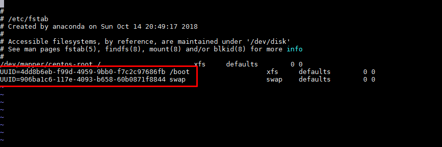

# File system trong Linux

### Mục lục

[1. Filesystem Structure](#file)

[2. Thư mục trong filesystem](#thumuc)

[3. File System Table](#fstab)

<a name="file"></a>
## 1. Filesystem Structure

Filesystem có cấu trúc giống như cây. Gốc bắt đầu từ thư mục root (/) tất cả các thứ mục khác sẽ là con của thư mục này.

Filesystem là các quy chuẩn về: cách thức cấp phát không gian lưu trữ cho file, quản lý thuộc tính của file, cách tổ chức sắp xếp dữ liệu trên các thiết bị sao cho việc tìm kiếm, truy cập tới dữ liệu nhanh chóng và thuận tiện.

Một hệ thống file là một tập hợp của các file và thư mục mà có các đặc tính sau:

	+ Nó có một thư mục gốc (/) mà chứa các file và thư mục khác.
	
	+ Mỗi file và thư mục được xác định duy nhất bởi tên của nó, thư mục mà trong đó nó cư trú, và một sự nhận diện duy nhất, được gọi theo cách đặc trưng là inode.
	
	+ Theo quy ước, thư mục gốc có số inode là 2 và thư mục lost+found có số inode là 3. Số inode 0 và 1 không được sử dụng. Các số inode có thể được gửi bởi trình xác định trong chức năng -i của lệnh ls.
	
	+ Nó có đặc tính khác nữa là tự chứa. Không có sự phụ thuộc giữa một hệ thống file này với một hệ thống file khác.

Các định dạng filesystem mà linux supports:

	+ ext3, ext4, btrfs, xfs (native Linux filesystems)
	
	+ vfat, ntfs, hfs (filesystems from other operating systems)
	
Mỗi hệ thống tiệp tin nằm trên một partition của đĩa cứng. Partitions giúp tổ chức nội dung của ổ đĩa theo các loại data nó chứa và cách nó sử dụng. 

Có hai cách hiểu tùy theo ngữ cảnh:

	+ Một hệ thống file (file system) là một kiểu lưu trữ và tổ chức các file và dữ liệu trong file để dễ tìm kiếm và truy cập. Hiện tại trong Linux phổ biến hai kiểu hệ thống file là ext3 và ext4.

	+ Một hệ thống file là một cây thư mục bao gồm một thư mục gốc (/), các thư mục con và các file chứa trong đó.

Trên mỗi partition chỉ có thể có một kiểu hệ thống file (được tạo ra khi format: ext3, ext4, fat, ntfs, …). Nhưng một cây thư mục có thể đặt trên nhiều partition: thư mục gốc / đặt ở partition sda2, thư mục /home đặt ở sda5, v.v… tùy ý người dùng chọn khi cài đặt.

Khi cài đặt OS cần tạo ra ít nhất 2 phân vùng, một để mount root cho \, một cho swap.

+ Có thể mount tự động thông qua file /etc/fstab, kernel sẽ đọc thông tin ở đây khi nó khởi động. Nếu sửa nội dung file này thì cần mount lại:

```
mount -a
```


Các thiết bị không có mặt trong file /etc/fstab thì chỉ có root mới có thể mount được.

User thường chỉ có thể mount được những thiết bị có trong file /etc/fstab thôi.

<a name="thumuc"></a>
## 2. Thư mục trong filesystem


/ ( Root ) : thư mục gốc , thư mục cha toàn bộ hệ thống.

/bin : chứa các tệp binary , chưa các lệnh của người dùng và toàn hệ hệ thống.

/boot : chưa các thư mục và tập tin cho quá trình bootloader.

/dev : chứa các thết bị ngoài vi, thiết bị đầu cuối gắn vào hệ thống.

/etc : chưa các tệp cấu hình của các package, và system.

/home : chứa các tập tin, thư mục của người dùng trên hệ thống.

/lib : chứa các thư viện cho các chương trình trong /bin và /sbin.

/ media : là các điểm gắt kết system với các thiết bị bên ngàoi , ex :/media/usb1.

/mnt : điểm gắt kết cho phép gắn trực tiếp filesystem.

/opt : chứa các gói phần mềm từ các package đã cài đặt.

/tmp : chứa các gói tập tin tạm thời của các package đang chạy, sẽ mất đi khi root.

/usr : phần vùng chỉ đọc , chứa các tiện ích mở rộng người dùng và package.

/proc : chứa các thông tin về các quá trình trên hệ thống.

/var : file về biến của chương trình Thông tin về các biến của hệ thống được lưu trong thư mục này

<a name="fstab"></a>
## 3. File System Table