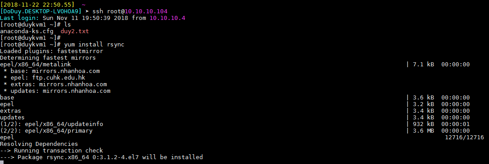

# Tìm hiểu về Synchronize data trong Linux

## 1. Khái quát

Rsync (Remote Sync) là một công cụ dùng để sao chép và đồng bộ file/thư mục được dùng rất phổ biến. Có thể dùng Rsync để đồng bộ dữ liệu trên local hoặc giữa các server với nhau một cách dễ dàng.

Rsync sử dụng thuật toán delta-copy (chỉ copy phần khác nhau) làm giảm số lượng dữ liệu gửi qua mạng bằng cách gửi chỉ những khác biệt giữa các tập tin nguồn và các tập tin hiện tại đích đến.

Rsync hỗ trợ copy giữ nguyên thông số của files/folder như Symbolic links, Permissions, TimeStamp, Owner và Group.

Rsync nhanh hơn scp vì Rsync sử dụng giao thức remote-update, chỉ transfer những dữ liệu thay đổi mà thôi.

Rsync tiết kiệm băng thông do sử dụng phương pháp nén và giải nén khi transfer.

Rsync không yêu cầu quyền super-user.

Rsync có 2 mode:
	+ Một là dùng như lệnh copy bình thường (ssh, rsh). 
	
	+ Hai là chạy deamon (hay gọi là service). Rsync daemon mặc định bind đến cổng 873. Khi chạy ở daemon mode, rsync có thể hoạt động giống 1 ftp server, tức cho phép download file public. Config rsync daemon được thực hiện trong file rsyncd.conf.
	


## 2. Cài đặt và thực hiện rsync

```
yum install rsync
```




