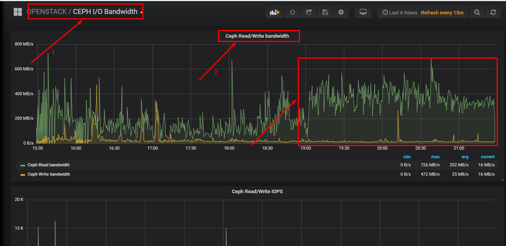
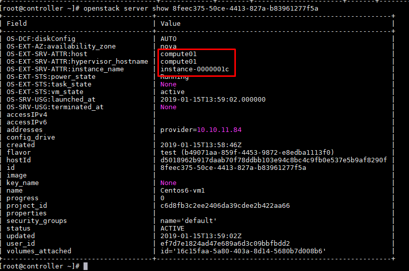
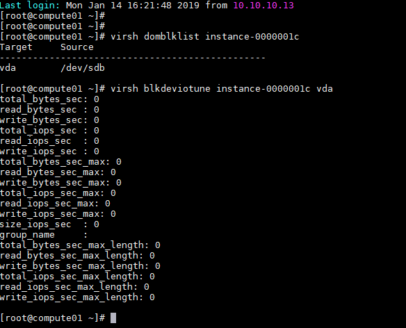

# Lab limit Bandwidth IO trên VM

Khi phát hiện 1 VPS có hiện tượng Bandwidth IO cao được phát hiện qua một số cách nhứ:

+ Có cảnh báo qua telegram về đường bond3 (CEPH-COM) traffic cao


+ Kiểm tra các traffic qua biểu đổ

Traffic Port CEPH-COM to Compute 


CEPH I/O Bandwidth 



=> Xác định được VM ở COM nào đang gây ra hiện tượng I/O Bandwidth cao.

+ Xác định chính xác VM nào.

ssh vào COM đó sử dụng lệnh `virt-top`


Trích xuất thông tin instance-xxx

dump file xml để lấy thông tin ID

```
virsh dumpxml instance-xxx
```

## Test QoS Bandwidth IO

+ Chuẩn bị 1 VPS 

Lấy ID VM trên KVM



+ Thực hiện trên node COM chứa VM đó.

Xem VM đó đã được áp policy QoS nào chứa.

```
virsh domblklist instance-0000001c

virsh blkdeviotune instance-0000001c vda
```



Như trên hình là chưa có policy được áp dụng đối với VM này trên KVM.

+ Test thử VM đó.

```
Read rand 4k
sync; echo 3 > /proc/sys/vm/drop_caches && name=read-rand; fio --randrepeat=1 --rw=randread --ioengine=libaio --size=4G --filename=testfile --name=read-rand --direct=1 --gtod_reduce=1 --bs=4k --iodepth=64 --runtime=600 --time_based && rm -rf testfile
```


